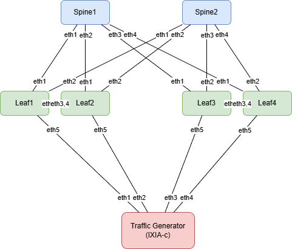
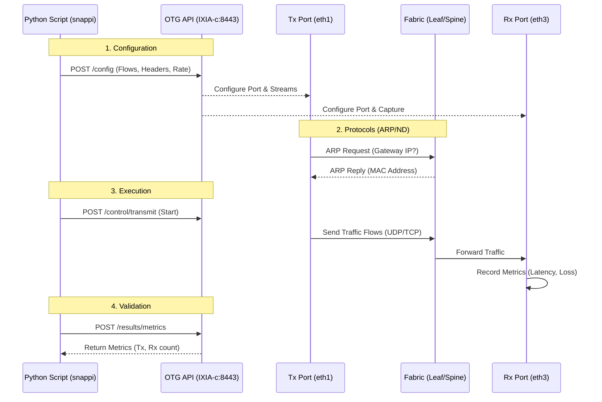
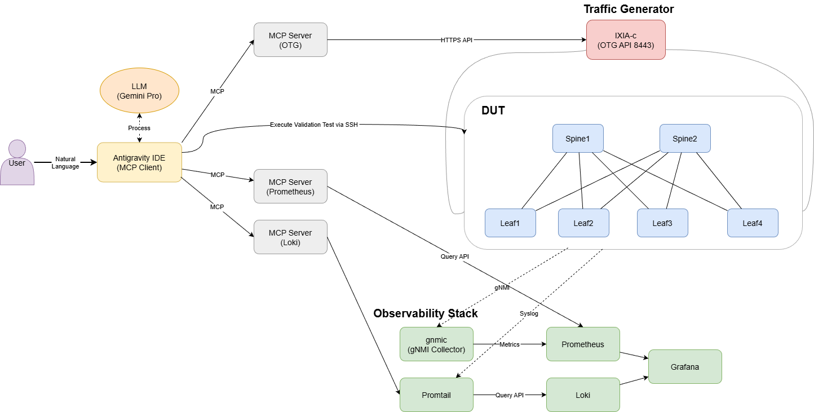
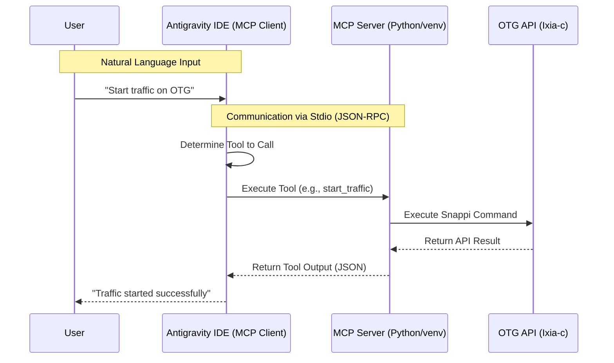
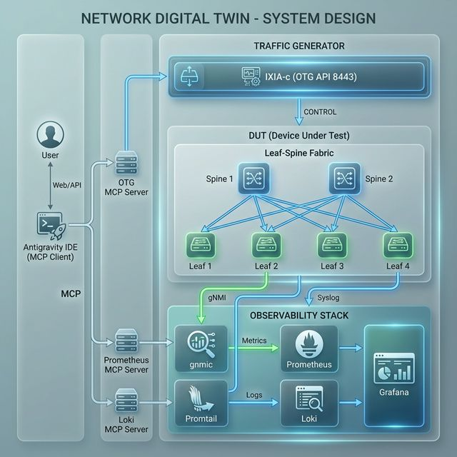

# Agentic AI-Driven Network Validation Test

This repository contains a Containerlab environment for testing BGP-EVPN VXLAN fabrics using Keysight's IXIA-c Open Traffic Generator (OTG).

## 1. How to setup

To deploy the lab environment:

```bash
git clone https://github.com/tadashota212/otg-test.git
cd otg-test
sudo containerlab deploy -t otg-test.clab.yml
```

This will spin up:
- 2x Spine switches (Arista cEOS)
- 4x Leaf switches (Arista cEOS)
- 1x Traffic Generator (Keysight IXIA-c-one)

## 2. Network Topology

### Architecture
- **Topology:** IP-Clos network design
- **Underlay:** OSPF used for loopback reachability to establish VTEP connectivity.
- **Overlay:** BGP EVPN VXLAN for L2/L3 VPN services.
- **Redundancy:** Leaf switches are configured in MLAG pairs (Leaf1/2 and Leaf3/4) for high availability.
- **Connectivity:** The Traffic Generator (IXIA-c) connects to the fabric via an MLAG port-channel to each Leaf pair.

### Topology Diagram


## 3. Traffic Generator

### Overview
Traffic generation and analysis are performed using the **Keysight IXIA-c-one** container. This container exposes an Open Traffic Generator (OTG) compatible API service on port `8443`.

It allows for defining complex traffic flows, packet crafting, and real-time metrics collection via standard API calls (snappi).

### Running Traffic Tests (Without MCP)
A direct Python script using the `snappi` library is provided in the `samples` directory to demonstrate basic traffic generation.

**Prerequisites:**
- Python 3.9+ installed
- Install the `snappi` library:
  ```bash
  pip install snappi
  ```

**Running the Sample:**
The sample script `samples/traffic_scenario.py` establishes a flow from Leaf1 side to Leaf3/4 side and verifies connectivity.

```bash
python3 samples/traffic_scenario.py
```

**Sample Output:**
```
Connecting to OTG at https://172.20.20.37:8443...
Applying configuration...
Starting traffic...
Monitoring metrics for 10 seconds...
[1s] Tx: 98, Rx: 98, Loss: 0
[2s] Tx: 179, Rx: 179, Loss: 0
...
Done.
```

### Operational Workflow



## 4. Traffic Generator through MCP Servers

This environment supports integration with an **MCP (Model Context Protocol) Server**, allowing AI IDEs (like Antigravity) to control the traffic generator using natural language.

### Architecture

The MCP Server acts as a bridge between the AI Client (e.g., Antigravity IDE) and the OTG API. It runs as a Python process on the host, communicating with the client via standard input/output (Stdio).


*(Note: Using Antigravity IDE instead of Claude Desktop)*

The control flow is:
1. User inputs natural language commands to Antigravity IDE
2. Antigravity IDE determines which tools to call
3. MCP Server receives tool calls via JSON-RPC
4. Control scripts use the `snappi` library to communicate with the OTG Controller
5. OTG Controller manages the Traffic Generator via its API (port 8443)

### Operational Workflow

The following sequence diagram details the message flow during a typical operation:



### Components

1.  **MCP Server (`otg-mcp`)**:
    - A Python application that implements the Model Context Protocol.
    - Based on the open-source project: [h4ndzdatm0ld/otg-mcp](https://github.com/h4ndzdatm0ld/otg-mcp)
    - **Running in a local virtual environment (venv)** instead of Docker for easier development and debugging.
    - Located in the `otg-mcp` directory.

2.  **Configuration**:
    - **`otg-mcp-config.json`**: Defines the OTG API endpoint and port mappings.
    - **`start_mcp.sh`**: A helper script to launch the server within the correct Python virtual environment.

3.  **Client Integration**:
    - Antigravity IDE connects to the `start_mcp.sh` script via Stdio.
    - Ideally configured in `mcp_config.json` with `PYTHONUNBUFFERED=1` to ensure real-time communication.

### Note: Reproduction Steps

To reproduce this environment in another setting:

1.  **Clone the Repository**:
    ```bash
    git clone https://github.com/h4ndzdatm0ld/otg-mcp.git
    ```

2.  **Apply Crucial Fixes (Code Patching)**:
    The original repository requires patching to prevent `stdout` pollution by libraries like `snappi`, which breaks JSON-RPC communication.

    *   **`server.py`**:
        *   Monkey-patch `logging.StreamHandler` to force all logs to `stderr`.
        *   Explicitly register tools using `@mcp.tool()` decorators.
        *   Fix parameter order in tool functions (e.g., `get_metrics`) to match the client.
    *   **`client.py`**:
        *   Pass `logger=logger` when initializing `snappi.api()` to prevent it from creating a default `stdout` handler.

3.  **Environment Setup**:
    *   Create a Python virtual environment (`python3 -m venv .venv`).
    *   Install dependencies (`pip install -e .`).
    *   Create a startup script (`start_mcp.sh`) that activates the venv and runs `python -m otg_mcp.server`.

4.  **IDE Configuration (`mcp_config.json`)**:
    ```json
    {
      "mcpServers": {
        "otg-mcp": {
          "command": "/path/to/start_mcp.sh",
          "args": [],
          "env": {
            "MCP_LOG_LEVEL": "INFO",
            "PYTHONUNBUFFERED": "1"
          }
        }
      }
    }
    ```
    *   `PYTHONUNBUFFERED="1"` is critical for real-time communication.

## 5. Observability Stack

### Overview
This project includes a comprehensive multi-layer observability stack designed to monitor network performance and analyze logs in real-time. It provides visibility into both the data plane (via gNMI metrics) and the control plane (via Syslog).

### Architecture
1.  **Metric Collection (`gnmic`)**: A gNMI collector that streams telemetry data (interface counters, CPU, memory) from the cEOS routers.
2.  **Metrics Storage (Prometheus)**: Stores time-series data collected by `gnmic`.
3.  **Log Aggregation (Loki & Promtail)**: `Promtail` acts as a Syslog receiver on TCP 1514, which then pushes logs to the `Loki` indexing service.
4.  **Visualization (Grafana)**: Provides interactive dashboards to correlate metrics and logs during traffic tests.

### Configuration Highlights
- **`telemetry/gnmic-config.yml`**: Configures subscriptions to `/interfaces/interface[name=*]/state/counters` with 10s sampling and processes "UP/DOWN" states into boolean values.
- **`telemetry/promtail-config.yml`**: Configures a TCP syslog listener and relabels logs based on hostname and severity for easy filtering.
- **`telemetry/prometheus.yml`**: Scrapes the `gnmic` output on port 9804.

## 6. Observability Data Access through MCP Servers

### Architecture
To enable AI-driven network analysis, the project exposes the observability data through the Model Context Protocol (MCP). This allows the AI agent to interact with the environment using specialized tools.



### Key Capabilities
- **Prometheus MCP Server**: Allows the AI agent to execute PromQL queries to retrieve interface stats, BGP states, and system performance.
- **Loki MCP Server**: Enables log searching and event correlation using LogQL (e.g., finding BGP state changes during a link failure).
- **OTG MCP Server**: Provides natural language control over traffic generation and real-time loss metrics retrieval.

By integrating these servers, the Antigravity IDE can autonomously detect anomalies, correlate traffic loss with BGP events, and perform automated validation tests.
