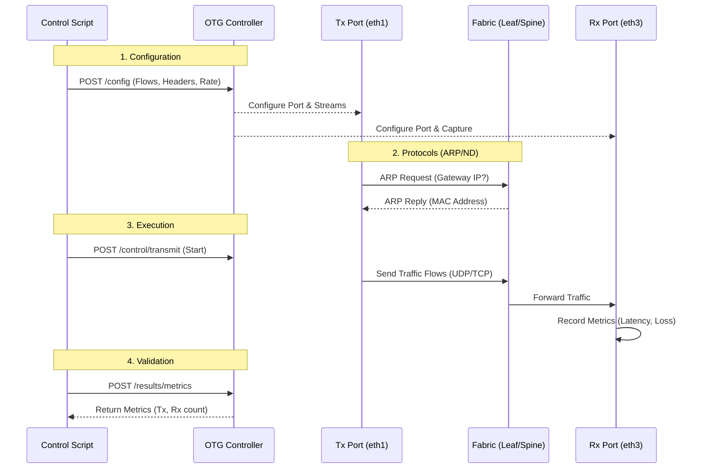
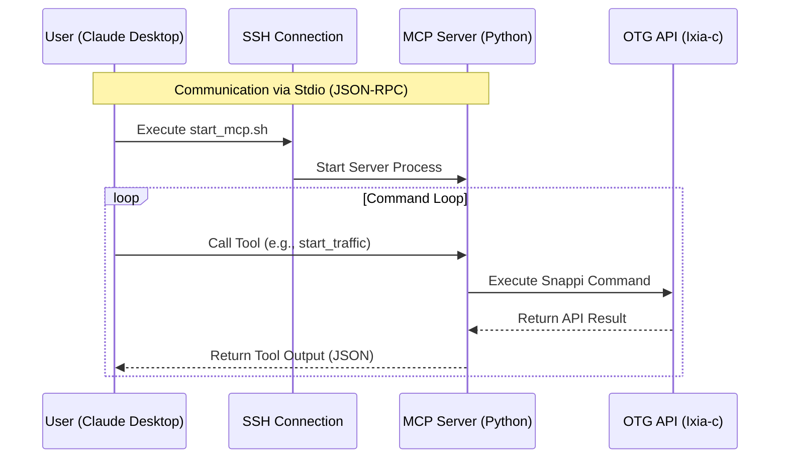

# OTG Test Environment

This repository contains a Containerlab environment for testing BGP-EVPN VXLAN fabrics using Keysight's IXIA-c Open Traffic Generator (OTG).

## 1. How to setup

To deploy the lab environment:

```bash
git clone https://github.com/tadashota212/otg-test.git
cd otg-test
sudo containerlab deploy -t otg-test.clab.yml
```

This will spin up:
- 2x Spine switches (Arista cEOS)
- 4x Leaf switches (Arista cEOS)
- 1x Traffic Generator (Keysight IXIA-c-one)

## 2. Network Topology

### Architecture
- **Topology:** IP-Clos network design
- **Underlay:** OSPF used for loopback reachability to establish VTEP connectivity.
- **Overlay:** BGP EVPN VXLAN for L2/L3 VPN services.
- **Redundancy:** Leaf switches are configured in MLAG pairs (Leaf1/2 and Leaf3/4) for high availability.
- **Connectivity:** The Traffic Generator (IXIA-c) connects to the fabric via an MLAG port-channel to each Leaf pair.

### Topology Diagram


## 3. Traffic Generator

### Overview
Traffic generation and analysis are performed using the **Keysight IXIA-c-one** container. This container exposes an Open Traffic Generator (OTG) compatible API service on port `8443`.

It allows for defining complex traffic flows, packet crafting, and real-time metrics collection via standard API calls (snappi).

### Running Traffic Tests (Without MCP)
A direct Python script using the `snappi` library is provided in the `samples` directory to demonstrate basic traffic generation.

**Prerequisites:**
- Python 3.9+ installed
- Install the `snappi` library:
  ```bash
  pip install snappi
  ```

**Running the Sample:**
The sample script `samples/traffic_scenario.py` establishes a flow from Leaf1 side to Leaf3/4 side and verifies connectivity.

```bash
python3 samples/traffic_scenario.py
```

**Sample Output:**
```
Connecting to OTG at https://172.20.20.37:8443...
Applying configuration...
Starting traffic...
Monitoring metrics for 10 seconds...
[1s] Tx: 98, Rx: 98, Loss: 0
[2s] Tx: 179, Rx: 179, Loss: 0
...
Done.
```

### Operational Workflow



## 4. OTG MCP Server
## 4. OTG MCP Server

This environment supports integration with an **MCP (Model Context Protocol) Server**, allowing LLMs (like Claude) to control the traffic generator using natural language.

### Architecture

The MCP Server acts as a bridge between the LLM client (e.g., Claude Desktop) and the OTG API. It runs as a Python process on the host, communicating with the client via standard input/output (Stdio) over SSH.



### Components

1.  **MCP Server (`otg-mcp`)**:
    - A Python application that implements the Model Context Protocol.
    - Located in the `otg-mcp` directory (based on `https://github.com/h4ndzdatm0ld/otg-mcp`).
    - Uses `snappi` library to translate natural language tool calls into OTG API commands.

2.  **Configuration**:
    - **`otg-mcp-config.json`**: Defines the OTG API endpoint and port mappings.
    - **`start_mcp.sh`**: A helper script to launch the server within the correct Python virtual environment.

3.  **Client Integration**:
    - The Claude Desktop App (or other MCP clients) connects via SSH and executes `start_mcp.sh`.
    - This establishes a persistent connection where the LLM can invoke tools like `start_traffic` or `get_metrics` directly.

